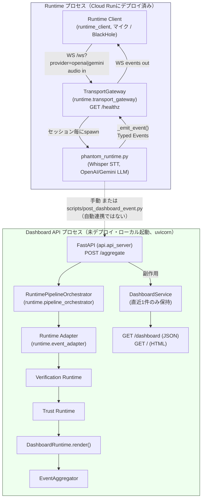

# Phantom Runtime Lite

## Project Overview

### 目的

Phantom Runtime Liteは、ライブ会話をリアルタイムに観測し続ける**Conversational AI Agent Runtime**である。単発のプロンプト応答ではなく、発話の書き起こし・話者推定・エージェント応答生成・各Runtimeイベントの信頼性検証を継続的に行い、**Human-in-the-loop**の運用フローにおける人間オペレーターの意思決定を支援する。

### 特徴

- リアルタイム音声ストリーミング（Runtime Client → WebSocket → Cloud Run）
- Speech-to-Text（Whisper）とLLM応答生成（OpenAI / Gemini）の分離
- Runtime Event（Typed Event）を起点とした、検証（Verification）・信頼度算出（Trust）・可視化（Dashboard API）の独立した下流パイプライン
- Cloud Run上でのオンデマンド稼働（ProviderはWebSocket接続ごとにセッション単位で選択）

### 対象

**DevOps × AI Agent Hackathon 2026** の公開提出物。DevOpsインシデント対応会議など、リアルタイムの会話に対して人間の意思決定を支援する用途を想定している。

### Current Status

- Cloud Runには**Production WebSocket Runtime**（`runtime.cloud_run_shell` が `phantom_runtime.py` を子プロセスとして駆動し、`runtime.transport_gateway` が `GET /healthz` と `WS /ws` を公開する構成）がデプロイ済みで、現在稼働している唯一のCloud Run公開エンドポイントである。
- H4 Runtime Extension（Runtime Event Contract / Runtime Adapter / Verification Runtime / Trust Runtime / Dashboard Runtime / Event Aggregator / FastAPI）は実装・検証済み（`docs/ROADMAP_V10.md`、`docs/H4_10_VALIDATION_REPORT.md`）だが、**Cloud Run Runtimeのライブイベントストリームに自動接続する常駐コンシューマは未実装**であり、H4拡張自体もCloud Runにはデプロイされていない（詳細は [Dashboard API](#dashboard-api) を参照）。

### 実装済みProvider

| Provider | 用途 | 選択方法 | 本Hackathon提出における位置付け |
|---|---|---|---|
| OpenAI | Whisper Speech-to-Text（Provider選択に関わらず常時使用）、および `provider=openai` セッションのLLM応答生成 | `/ws?provider=openai` | **正式デモ構成（推奨）** |
| Gemini | `provider=gemini` セッションのLLM応答生成 | `/ws?provider=gemini` | Known Issue（[Known Limitations](#known-limitations)参照、WebSocket `1011`→`409`再発、Status: Open） |

Providerは環境変数ではなく、WebSocket接続ごとのクエリパラメータ（`provider=openai` または `provider=gemini`、必須）で選択する。選択は `runtime.provider_router` がRuntime子プロセス起動前に検証する（H5-1、セッションスコープ）。Gemini自体は正常に動作するが、[Known Limitations](#known-limitations)記載の未解決事象があるため、本提出のデモ・Operator E2Eは**OpenAI構成を正式構成として実施する**。

### Cloud Run対応状況

- デプロイ済み。`GET /healthz`（liveness）と `WS /ws`（音声入力・Runtimeイベント出力）を公開する。
- Single Runtime Policy: 同時接続は1セッションのみ。2つ目の接続は `HTTP 409` を返す。
- Provider未指定・不正指定は `HTTP 400` を返す。

---

## Architecture



RuntimeとDashboard APIは**独立したプロセス**であり、相互のimport・自動連携は存在しない（点線は「自動化されていない、手動またはスクリプト駆動の経路」を示す）。詳細は [Dashboard API](#dashboard-api) を参照。

---

## Components

| Component | モジュール | 役割 |
|---|---|---|
| Cloud Run Runtime | `src/runtime/transport_gateway.py`, `src/runtime/cloud_run_shell.py` | `GET /healthz` / `WS /ws` を公開し、接続毎に `phantom_runtime.py` を子プロセスとして起動・終了管理する Cloud Run Compatibility Shell |
| Runtime Client | `src/runtime_client/` | マイク（またはBlackHole）入力 → Recording Gate → Speech Gate → WebSocket送信、および受信したTyped EventのKeyboard UX表示 |
| Speech Provider | `src/provider/openai_speech_provider.py`, `src/provider/gemini_speech_provider.py`, `src/provider/speech_provider.py` | Speech-to-Textの抽象化。実装はOpenAI Whisperのみが `phantom_runtime.py` から常時使用される |
| LLM Provider | `src/provider/openai_provider.py`, `src/provider/gemini_provider.py`, `src/provider/interface.py` | セッションで選択されたProvider（OpenAI / Gemini）による応答生成 |
| Runtime Adapter | `src/runtime/event_adapter.py` | `phantom_runtime.py` の `_emit_event()` 生JSON（`version`/`type`/`timestamp`/`payload`）を、Contract形式のRuntimeEvent（`schema_version`/`event_id`/`timestamp`/`session_id`/`sequence`/`type`/`payload`）へ変換するのみの、Verification Runtimeの前段コンポーネント |
| Verification Runtime | `src/verification/verification_runtime.py` | Typed Eventを1件ずつ受け取り、Contract（必須フィールド・順序）に照らして `gap_detected` / `fallback_detected` / `reliability_score` 等の `VerificationResult` を生成する読み取り専用Runtime |
| Trust Runtime | `src/trust/trust_runtime.py` | `VerificationResult` のみを入力に、Trust Policyに基づき `trust_score` / `trust_level` / `human_review_required` を算出するステートレスなRuntime |
| Dashboard API | `src/api/api_server.py`, `src/api/dashboard_service.py`, `src/dashboard/dashboard_runtime.py` | Verification/Trust結果を集約し、`GET /dashboard`（JSON）/ `GET /`（HTML）として公開するFastAPIアプリ。詳細は [Dashboard API](#dashboard-api) を参照 |
| Conversation Traceability | `raw_event["metadata"]`（`conversation_line` / `speaker` / `transcript`） | Runtime Eventのmetadataから読み取り、変換・推測せずDashboardまでそのまま伝播する識別情報（`docs/H4_RUNTIME_EVENT_CONTRACT.md` "Runtime Event Metadata"） |
| Typed Events | `docs/H4_RUNTIME_EVENT_CONTRACT.md` | `phantom_runtime.py` の `_emit_event()` が出力する6種類のイベント（`transcript` / `reply` / `analysis` / `latency` / `status` / `error`） |

---

## Repository Structure

| ディレクトリ | 役割 |
|---|---|
| `src/phantom_runtime.py` | 会話Runtime本体。STT呼び出し・LLM応答生成・Meeting Analysis・Typed Event送出を行う単一モジュール |
| `src/runtime/` | Cloud Run Compatibility Shell（`cloud_run_shell.py`）、WebSocket/セッション終了処理（`transport_gateway.py`）、Provider Router、H4パイプラインを production コードから呼び出し可能にする `pipeline_orchestrator.py` |
| `src/runtime_client/` | ローカルRuntime Client（音声キャプチャ、Calibration、Speech Gate、WebSocket送受信、Keyboard UX） |
| `src/provider/` | LLM Provider（OpenAI / Gemini）とSpeech-to-Text Providerの抽象化 |
| `src/verification/` | Verification Runtime |
| `src/trust/` | Trust Runtime |
| `src/dashboard/` | Dashboard Runtime（`VerificationResult`/`TrustResult` を `DashboardResult` へ変換する、状態を持たない純粋関数） |
| `src/aggregator/` | Event Aggregator（`EventAggregate` の組み立て） |
| `src/api/` | Dashboard API（FastAPIアプリ、`DashboardService`、HTML描画、`templates/`） |
| `src/audio/` | Server VAD・音声バッファリング |
| `scripts/post_dashboard_event.py` | `RuntimePipelineOrchestrator.run()` → `POST /aggregate` を1コマンド化するスクリプト |
| `tests/` | ユニット・統合テスト（pytest） |
| `docs/` | Runbook・Roadmap・Bug Report・Architecture等のドキュメント一式（[Documentation](#documentation)参照） |
| `Dockerfile` | Cloud Run用コンテナイメージ定義（ベース: `python:3.14-slim`） |
| `requirements.txt` | 依存ライブラリ一覧 |

本リポジトリに `pyproject.toml` および `Makefile` は存在しない。依存関係管理・実行はいずれも `requirements.txt` と `pip` / `python -m` コマンドで行う。

---

## Requirements

| 項目 | 内容 |
|---|---|
| Python | 3.13+（ローカル実行）。Dockerイメージは `python:3.14-slim`（`Dockerfile`） |
| 依存ライブラリ | `requirements.txt`: `openai>=1.30.0`, `google-genai>=1.0.0`, `sounddevice>=0.4.6`, `numpy>=1.24.0`, `python-dotenv>=1.0.0`, `websockets>=13.0`, `fastapi>=0.110.0`。**`uvicorn` は含まれていない**（Dashboard API起動に別途必要、[Dashboard API](#dashboard-api)参照） |
| `.env` | リポジトリルート直下。`phantom_runtime.py` が起動時に読み込む（`load_dotenv`）。Dockerコンテナ内では読み込まれない（`.dockerignore` が `.env` を除外） |
| `OPENAI_API_KEY` | 必須。Whisper STT（Provider選択に関わらず常時使用）と `provider=openai` セッションのLLM応答生成に使用 |
| `GEMINI_API_KEY` | `provider=gemini` セッションを使う場合のみ必須 |
| BlackHole | 物理マイクの代わりにZoom/Meet/Teams等のアプリ音声、または合成音声をRuntime Clientの入力として使う場合の仮想オーディオデバイス（サードパーティ製、本リポジトリはインストール手順を持たない）。物理マイクを使う場合は不要 |

---

## Installation

```bash
git clone <this-repository>
cd phantom-runtime-lite

python3 -m venv .venv
source .venv/bin/activate
pip install -r requirements.txt
```

`.env` をリポジトリルートに作成する（ローカルで `src/` ディレクトリから `python -m phantom_runtime` を直接実行する場合、または直接デバッグする場合に使用。`.env` はスクリプトの場所を基準に解決されるため、実行時のカレントディレクトリに関わらずリポジトリルート直下の1ファイルを読み込む。Docker/Cloud Runでは使用されない）。

```bash
cat > .env <<'EOF'
OPENAI_API_KEY=sk-...
GEMINI_API_KEY=...
EOF
```

ローカルで `phantom_runtime.py` を直接実行する場合（マイク入力・デバッグ用途、Cloud Run/Dockerでは不要）:

```bash
cd src
python -m phantom_runtime --profile default --mode light
```

（`provider`/`audio`等のトップレベルモジュールを相対importしているため、`src/` に `cd` してから実行する必要がある。リポジトリルートから `python -m src.phantom_runtime` を実行すると `ModuleNotFoundError: No module named 'provider'` になる）

---

## Configuration

| 変数 | 必須 | 用途 |
|---|---|---|
| `OPENAI_API_KEY` | Yes | Whisper Speech-to-Text（常時）、OpenAI Provider選択時のLLM応答生成 |
| `GEMINI_API_KEY` | `provider=gemini` 選択時のみ | Gemini ProviderのLLM応答生成 |

Cloud Run本番環境では、これらは `gcloud run services update --update-env-vars` でCloud Runサービス自体に設定する（Runtime Client側の環境変数ではない）。

### Provider切替

環境変数によるProvider切替は行わない。WebSocket接続ごとに、Runtime Client起動時の `--provider` で指定する。**本Hackathon提出の正式デモ構成はOpenAIである。**

```bash
# OpenAI（正式デモ構成・推奨）
python -m runtime_client --url <URL> --provider openai --input-device "<device>"

# Gemini（動作するが Known Issue あり。[Known Limitations](#known-limitations) 参照）
python -m runtime_client --url <URL> --provider gemini --input-device "<device>"
```

`--provider` はサーバー側の `/ws?provider=openai|gemini` クエリパラメータに反映される。不正・未指定は `HTTP 400`。

---

## Quick Start

以下は `docs/RUNBOOK_PRODUCTION_VERIFICATION.md` と一致するコマンドである。詳細・トラブルシューティングは同Runbookを参照。

### 1. Runtime起動

実Cloud Run（デプロイ済み前提。未デプロイの場合は `docs/RUNBOOK.md` §4-§9を参照）:

```bash
gcloud run services describe phantom-runtime-lite \
  --region asia-northeast1 \
  --format="value(status.url)"
```

または、ローカルDocker（gcloud不要の代替）:

```bash
docker build --platform linux/amd64 -t phantom-runtime-lite:local .

docker run --rm --name phantom-local -p 8080:8080 \
  -e OPENAI_API_KEY="$OPENAI_API_KEY" \
  -e GEMINI_API_KEY="$GEMINI_API_KEY" \
  -e PORT=8080 \
  phantom-runtime-lite:local
```

### 2. Health確認

```bash
curl -i <CLOUD_RUN_URL>/healthz
# 期待: HTTP/2 200 / ok
```

### 3. Dashboard API起動

Runtimeとは別プロセスであり、既定ポートが競合しないよう `8081` を使う（Runtimeがローカル8080番を使っている場合の衝突回避）。

```bash
pip install uvicorn   # requirements.txt に含まれていないため別途必要
cd src
python -m uvicorn api.api_server:app --host 127.0.0.1 --port 8081
```

確認:

```bash
curl -s http://127.0.0.1:8081/dashboard
# → 404（まだ何も投入していない場合。異常ではない）
```

### 4. Runtime Client起動

`--provider openai` が本Hackathon提出の正式デモ構成である。

```bash
cd src
python -m runtime_client \
  --url <CLOUD_RUN_URL> \
  --provider openai \
  --input-device "<入力デバイス名>" \
  --production-verification
```

Geminiを使う場合は `--provider gemini` に変更する（動作するが、WebSocket `1011`→`409`再発のKnown Issueあり。[Known Limitations](#known-limitations)参照）。`--list-devices` で入力デバイス名を確認できる。

### 5. Production Verification（Operator E2E）

`r` キーでRECORDING ONにし、15〜20分程度発話を継続する。詳細な手順・合格条件は [Production Verification](#production-verification) を参照。

### 6. Dashboard確認

```bash
python scripts/post_dashboard_event.py --url http://127.0.0.1:8081
curl -s http://127.0.0.1:8081/dashboard
```

ブラウザで `http://127.0.0.1:8081/` を開くとHTML表示を確認できる。

### 7. Runtime Trace確認（任意）

```bash
PORT=8080 PHANTOM_TRACE=1 PHANTOM_TRACE_FILE=logs/trace.jsonl \
python -m runtime.cloud_run_shell -- --profile default --mode light --no-color --audio-source fd
```

詳細は [Runtime Trace](#runtime-trace) を参照。

### 8. 停止

- Runtime Client: `q` キー、または `Ctrl+C`
- Dashboard API: `Ctrl+C`
- ローカルDocker Runtime: `docker stop phantom-local`（または `Ctrl+C`）

---

## Production Verification

実Cloud Run環境・実機マイクを用いて、Startup Calibration・WebSocket接続・STT/LLM応答・Dashboard連携・TransportGateway Session Lifecycleを検証する手順である。

詳細な前提条件・コマンド・期待ログ・合格条件・トラブルシューティングは
**[docs/RUNBOOK_PRODUCTION_VERIFICATION.md](docs/RUNBOOK_PRODUCTION_VERIFICATION.md)** を参照。

---

## Dashboard API

### 役割

`src/api/api_server.py` が提供する**読み取り専用のFastAPIアプリ**（アプリ自身のタイトルは `"Phantom Runtime Lite — Read-Only Event API"`）。直近1件の `DashboardResult`（Verification/Trust結果 + Conversation Traceability情報）をHTTP経由で参照できるようにする、プレゼンテーション層である。

**「Dashboard Runtime」ではない。** パイプライン内部の1ステージ（`DashboardRuntime.render()`、`src/dashboard/dashboard_runtime.py`）にその名前が使われているが、外部に公開される機能全体としての正式名称は **Dashboard API** である。

### Runtimeとの関係

- Cloud Run Runtime（`runtime.cloud_run_shell` / `transport_gateway`）とは**完全に独立したプロセス**であり、相互のimportは存在しない。
- Cloud Runには**デプロイされていない**。ローカルで別途 `uvicorn` を用いて起動する前提。
- **Runtimeを起動してもDashboard APIはリアルタイム更新されない。** Runtimeが発行するTyped Eventを自動的にDashboard APIへ流し込む常駐コンシューマは、本リポジトリに存在しない。

### 更新経路

```
Runtime Event（phantom_runtime.py _emit_event() の生JSON）
        │  ※手動、または一度取得したイベントをファイル化
        ▼
RuntimePipelineOrchestrator.run(raw_event)   [src/runtime/pipeline_orchestrator.py]
        │  (Runtime Adapter → Verification Runtime → Trust Runtime
        │   → DashboardRuntime.render() → Event Aggregator)
        ▼
EventAggregate
        │  POST
        ▼
POST /aggregate   [src/api/api_server.py]
        │  副作用: DashboardService.set_latest(...)
        ▼
GET /dashboard (JSON) / GET / (HTML)
```

`scripts/post_dashboard_event.py` が上記の「Pipeline実行 → POST」を1コマンドで行う。

### 保持データ

`DashboardService`（`src/api/dashboard_service.py`）は**直近1件の `DashboardResult` のみ**をプロセス内メモリに保持する。履歴・永続化・複数セッションの同時保持は行わない。プロセス再起動で消える。

### 制約

- Runtimeとの自動ストリーミング連携なし（上記の通り、手動またはスクリプト経由の投入が必須）
- 直近1件のみの保持（履歴表示・グラフ・リアルタイム更新なし）
- 実装済みルートは `GET /health`, `POST /aggregate`, `GET /dashboard`, `GET /` の4つのみ（`/events` `/verification` `/trust` `/timeline` は未実装、`404`）

### 起動方法

```bash
pip install uvicorn
cd src
python -m uvicorn api.api_server:app --host 127.0.0.1 --port 8081
```

（RuntimeがローカルDockerで同じホストの8080番を使っている場合を想定し、Dashboard API側は8081を使用。競合しない場合は8080でもよい）

詳細は [docs/RUNBOOK_DASHBOARD.md](docs/RUNBOOK_DASHBOARD.md) を参照。

---

## Runtime Trace

`PHANTOM_TRACE=1`（任意で `PHANTOM_TRACE_FILE=<path>`）を設定すると、以下のイベントが構造化ログとして出力される（コード確認済み、`src/runtime_trace.py` および各呼び出し元）。

| 種類 | `stage` 文字列 | 出力元 |
|---|---|---|
| Speech | `Speech START` / `Speech END`（STT呼び出し境界）, `VAD FLUSH`（`reason=force`/`reason=silence`、Server VADのセグメント確定） | `src/phantom_runtime.py`, `src/audio/vad_buffering.py` |
| Session | `Session START` / `Session DISCONNECT` / `Session TEARDOWN START` / `Session TEARDOWN END` | `src/runtime/transport_gateway.py` |
| Health | 専用の `PHANTOM_TRACE` イベントは無い。`args.health_interval` 秒毎（既定60秒）の `PIPELINE STATE SNAPSHOT`（`threads_alive` 等を含む）、および `/healthz` の応答時間で代替する | `src/phantom_runtime.py` `health_monitor()` |
| Conversation | `Conversation APPEND` | `src/phantom_runtime.py` |
| Verification | 専用の `PHANTOM_TRACE` イベントは無い。`VerificationRuntime.handle()` の呼び出し結果（`GET /dashboard` の `gap_detected` 等）で確認する | `src/verification/verification_runtime.py` |
| Trust | 専用の `PHANTOM_TRACE` イベントは無い。`TrustRuntime.handle()` の呼び出し結果（`GET /dashboard` の `trust_score` 等）で確認する | `src/trust/trust_runtime.py` |

詳細な確認手順・正常なSession Lifecycle状態遷移は [docs/RUNBOOK_PRODUCTION_VERIFICATION.md](docs/RUNBOOK_PRODUCTION_VERIFICATION.md) §8 を参照。

---

## Documentation

| ドキュメント | 内容 |
|---|---|
| [docs/RUNBOOK.md](docs/RUNBOOK.md) | Cloud Runの構築・デプロイ・運用・障害切り分け手順 |
| [docs/RUNBOOK_PRODUCTION_VERIFICATION.md](docs/RUNBOOK_PRODUCTION_VERIFICATION.md) | Production Verification / Operator E2Eの実施手順（本READMEの Quick Start はこのRunbookと一致） |
| [docs/RUNBOOK_DASHBOARD.md](docs/RUNBOOK_DASHBOARD.md) | Dashboard API単体の詳細仕様・検証手順 |
| [docs/RUNBOOK_RUNTIME_VERIFICATION.md](docs/RUNBOOK_RUNTIME_VERIFICATION.md) | Verification/Trust/Dashboard/FastAPI各コンポーネントの内部呼び出し手順 |
| [docs/H4_RUNTIME_EVENT_CONTRACT.md](docs/H4_RUNTIME_EVENT_CONTRACT.md) | Runtime Event Contract（Typed Eventのスキーマ定義） |
| [docs/ARCHITECTURE.md](docs/ARCHITECTURE.md) | H4 Runtime Extensionのアーキテクチャ概要 |
| [docs/ROADMAP_V10.md](docs/ROADMAP_V10.md) | H4 Runtime Extensionの完了状況・検証結果サマリ |
| [docs/H4_10_VALIDATION_REPORT.md](docs/H4_10_VALIDATION_REPORT.md) | テストスイート・Production-like Validation・Regressionの詳細結果 |
| [docs/HACKATHON_KNOWN_ISSUES_AND_ROADMAP.md](docs/HACKATHON_KNOWN_ISSUES_AND_ROADMAP.md) | 実装済み範囲・既知の制約・改善計画 |
| [docs/bugs/](docs/bugs/) | Bug Report / Fix Report一覧（下記 [Known Limitations](#known-limitations) 参照） |
| [docs/SUBMISSION_STORY.md](docs/SUBMISSION_STORY.md) | ハッカソン提出のプロダクトビジョン・課題設定 |

---

## Known Limitations

- **Dashboard APIはRuntimeと自動連携しない。** Runtime起動・会話進行だけではDashboard APIの表示内容は更新されない（[Dashboard API](#dashboard-api)参照）。
- **Dashboard APIの更新には `POST /aggregate` への手動またはスクリプト経由の投入が必要。** `scripts/post_dashboard_event.py` を使うか、`RuntimePipelineOrchestrator.run()` の出力を手動でPOSTする。
- **Dashboard APIはCloud Runにデプロイされていない。** ローカルで `uvicorn` により別途起動する前提。
- **Gemini構成で、WebSocketの `1011`（keepalive ping timeout）→ 再接続時 `409`（reconnect conflict）が再発する既知の未解決事象がある。** OpenAI構成では現時点で未再現。原因（TransportGateway/Gemini SDK/WebSocketライブラリ/runtime_client/reply_workerのいずれか）は未特定。**この既知の未解決事象があるため、本Hackathon提出における正式デモ構成はOpenAI（`--provider openai`）とする。** Geminiは動作するが未解決のKnown Issueとして扱う。Bug Reportで管理中（[docs/bugs/BUG-2026-07-12-gemini-websocket-1011-keepalive-409-reconnect-recurrence.md](docs/bugs/BUG-2026-07-12-gemini-websocket-1011-keepalive-409-reconnect-recurrence.md)、Status: Open）。
- **WebSocket再接続後、`g`キー（Runtime Event表示）が動作しなくなる既知の未解決事象がある。** Conversation自体・`l`キー（Conversation History表示）は再接続後も正常動作する。Root Causeは未特定。Bug Reportで管理中（[docs/bugs/BUG-2026-07-11-runtime-event-display-stops-after-reconnect.md](docs/bugs/BUG-2026-07-11-runtime-event-display-stops-after-reconnect.md)、Status: Open）。
- **Dashboard APIの実装済みルートは `GET /health`, `POST /aggregate`, `GET /dashboard`, `GET /` の4つのみ。** `/events` `/verification` `/trust` `/timeline` は未実装（`404`）。
- **Dashboard APIは直近1件の `DashboardResult` のみを保持する。** 履歴・永続化・複数セッション同時保持は行わない。

---

## Roadmap

H4 Runtime Extensionの完了状況・検証結果は
**[docs/ROADMAP_V10.md](docs/ROADMAP_V10.md)** に記録されている（Runtime Event Contract〜Final Validationまで全項目Completed）。

---

## License

[Apache License 2.0](LICENSE)
