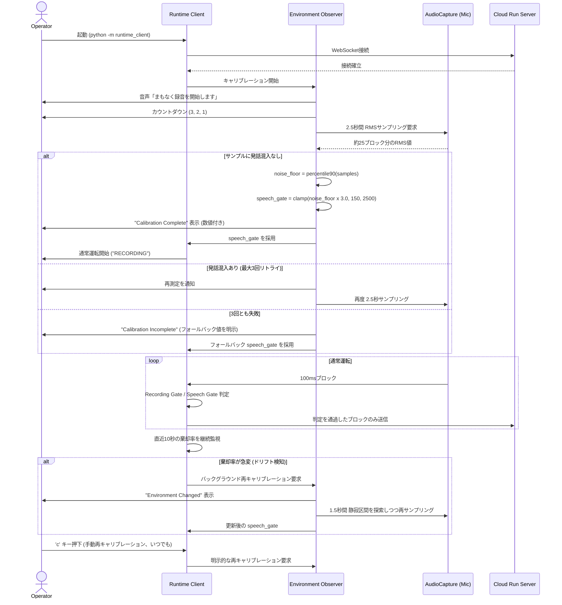
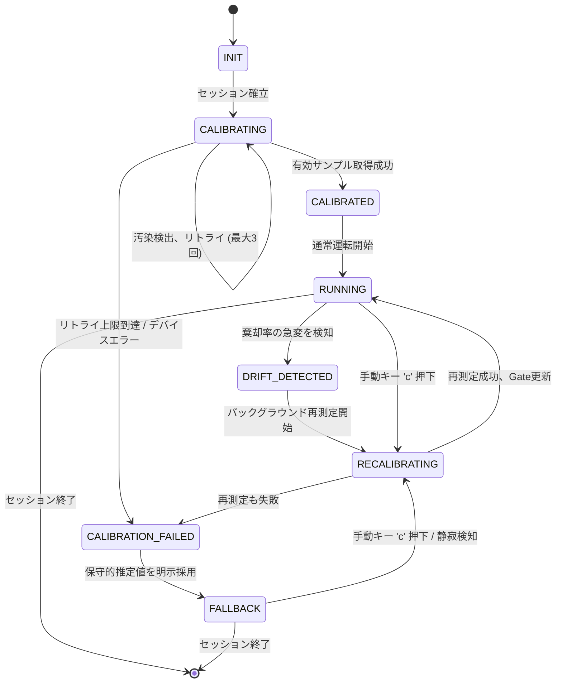

# Adaptive Runtime Calibration

> **Status:** Design-only proposal. No source code has been written or modified as part of this document.
> **Scope:** Runtime Client (`src/runtime_client/`) only. Server (`phantom_runtime.py`, Cloud Run) is unaffected by this proposal.
> **Origin:** This document is the direct output of a forensic investigation into a P5-4-2 production regression (see §1.2). It is intended to be reviewed externally (including by ChatGPT) as a standalone design artifact, so every decision below states its rationale, the alternatives considered, and why those alternatives were rejected.

---

## Runtime Philosophy

本設計の根底にあるのは、今回の Audio Calibration という一機能に閉じない、Phantom Runtime 全体に適用されるべき基本思想である。以下にその考え方を明文化する。

**Phantom Runtime は、実行環境を固定値で仮定しない。** マイクの種類、OS の入力ゲイン、部屋の暗騒音、話者とマイクの距離——これらはすべて、Runtime が動く場所によって変わる変数である。ソースコードに埋め込まれた単一の定数は、これらの変数のうちどれか一つの組み合わせにしか正しく振る舞わない。したがって、Runtime の挙動を決めるパラメータを「あらかじめ決め打ちする」という設計そのものが、環境が変わるたびに再発する不具合の温床になる。

**Runtime はまず環境を観測する。** 何かを判定・実行する前に、Runtime は自分が置かれている実行環境について、実測に基づく知識を持つべきである。これは今回であれば「静寂時のマイク入力の RMS 値」だが、原則としては「Runtime が動作の前提としている外部条件を、仮定するのではなく測定する」という態度そのものを指す。

**観測結果から実行パラメータを導出する。** 観測は、それ自体が目的ではない。観測して得られた値は、Runtime が下す判断(送信するか、閾値をどこに置くか等)の根拠として直接使われる。パラメータは「開発者が決めて埋め込む値」ではなく、「Runtime が実行時に計算する値」であるべきである。

**固定値より Runtime Observation を優先する。** 固定値による判定と、観測に基づく判定のどちらも選べる場面では、後者を優先する。固定値は実装が単純である一方、環境依存のバグを本質的に内包する。観測に基づく設計は初期実装コストが高くとも、環境が変わるたびに再修正が必要になるという長期的なコストを避けられる。

**環境変化を検知したら、必要に応じて再適応する。** 環境の観測は起動時の一度きりで完結しない。Runtime が稼働し続ける間、環境もまた変化しうる(マイクの持ち替え、場所の移動、周囲の騒音レベルの変化)。Runtime は自分の判断の前提となっている観測結果が古くなっていないかを継続的に監視し、乖離を検知した場合は再度観測し直す能力を持つべきである。

**この思想は、今回の Audio Calibration に限定されない。** 本ドキュメントが扱う Speech Gate の導出は、この思想を Runtime Client の一機能に適用した最初の具体例に過ぎない。将来 Phantom Runtime の他の部分(VAD パラメータ、再生音量、その他ハードコードされた実行時定数)に同種の環境依存性が見つかった場合も、同じ思想——「仮定せず、観測し、そこから導出し、変化に適応する」——を適用する対象として扱う(詳細は §11 Future Extensions を参照)。

---

## Incident Origin

本設計がどのような経緯で立ち上がったかを、トレーサビリティのために明記する。

| 項目 | 内容 |
|---|---|
| **Incident** | P5-4-2 Recording OFF Send Gate Investigation |
| **調査環境** | Production 相当 E2E(実マイク・実 WebSocket・実 Cloud Run・実 `kb_thread` を使用した検証) |
| **実測結果** | 10秒間の実発話に対し、AudioCapture コールバックは **294 blocks** 発火 → `AudioBridge._run_pump()` の RMS 判定で **293 blocks が棄却** → 原因は環境非依存の **Fixed RMS Threshold(700)** であることをコード読解と実行時計測の両方で確認 |
| **契機** | 上記の実測結果を受け、「別の固定値に差し替える」対応ではなく、Runtime が実行環境を観測してから閾値を導出する設計——**Adaptive Runtime Calibration**——を新たに設計した |

このインシデント調査の詳細な経緯(コードレビュー・Production相当E2E・Client内部ブロック数の実行時計測)は §1.2 に記載している。本セクションは、その調査結果がどのように本設計の出発点になったかを一段圧縮して示すものである。

---

## 1. Background

### 1.1 背景

Phantom Runtime Lite の Runtime Client は、マイクから取得した音声ブロック(100ms 単位、PCM16LE)を WebSocket 経由で Cloud Run 上の Server に送信する。Server 側の VAD(Voice Activity Detection)や Whisper への負荷を抑えるため、Client 側では送信前に「このブロックは無音か」を判定し、無音であれば送信自体をスキップする `Silence Gate`(P5-4-1 で導入)が存在する。

この判定は `src/runtime_client/audio_bridge.py` の `AudioBridge._run_pump()` 内で、以下の一行によって行われている(現行コード、変更提案の対象ではあるが本ドキュメント自体はこの行を変更しない):

```
if block_rms(block) < self._silence_rms_threshold:
    continue
```

`silence_rms_threshold` はコード上の固定定数 `DEFAULT_SILENCE_RMS_THRESHOLD = 700`(`src/runtime_client/config.py`)であり、CLI からの上書き手段も存在しない。この値は、過去の検証(P5-4-1)においてある特定の外部マイク・ある特定の部屋で実測されたノイズフロア(最大 530.2 RMS)に対してマージンを取って選ばれたものである。

### 1.2 今回の不具合調査結果

P5-4-2(Recording OFF Send Gate)実装後、「RECORDING ON でも Transcript / Reply が一切出ない」という実機回帰が報告された。本ドキュメントに先行する複数回のフォレンジック(いずれもコード変更なしの調査フェーズ)により、以下が事実として確定している。

1. Runtime Client 側のコードレビュー(静的解析)では、Recording Gate・Silence Gate ともにロジック上の欠陥は確認できなかった。Unit Test 362 件はすべて PASS。
2. Production 相当 E2E(実マイク・実 WebSocket・実 Cloud Run・実 `kb_thread` を使用)を複数回実施した結果、WebSocket 接続・`AudioBridge.start()`・`AudioCapture`・`InputStream`・`kb_thread` はすべて正常に動作することを確認した。
3. Server 側コードのフォレンジック(読み取り専用)により、Server は受信した音声ブロックを無条件に中継するだけであり、Transcript 生成には Server 側 VAD が「8.0 秒連続音声」または「200ms 以上の無音区間」のいずれかを検出して初めて Whisper を呼び出す設計であることを確認した。
4. **Client 内部のブロック数ライフサイクルを Monkey Patch による実行時計測(コード変更なし)で追跡した結果、10 秒間の実発話に対して AudioCapture のコールバックは 294 回発火していたにもかかわらず、`AudioBridge._run_pump()` の RMS 判定を通過したブロックはわずか 1 個(0.3%)であったことを実測した。** 残る 293 ブロックはすべて `block_rms(block) < 700` の一行で棄却されていた。Recording Gate・raw_queue・out_queue・WebSocket 送信の各段階はブロックを一切失っていないことも同じ計測で確認済みである。

つまり、報告された「Transcript が出ない」という症状の実測上の起点は、Recording Gate(P5-4-2)でも WebSocket 経路でもなく、**P5-4-1 で導入された固定 RMS Threshold(700)が、今回の実行環境(マイク・部屋・入力Gain)における実際の発話音圧を下回っていたこと**であった。

### 1.3 固定RMS Threshold設計の課題

700 という値は、ある一度の検証環境(特定の外部マイク・特定の部屋)で測定された結果であり、以下のいずれの変数にも紐づいていない。

- マイクの種類(内蔵マイク / USB外部マイク / Bluetoothヘッドセット / 会議室のアレイマイク)
- OS の入力ゲイン設定
- 部屋の暗騒音レベル
- 話者とマイクの距離

したがって、この定数は「ある環境では動くが、別の環境では動かない」という性質を本質的に持つ。今回の実機回帰は、まさにこの性質が顕在化した事例である。**このドキュメントの目的は、700 という数値を別の数値に置き換えることではなく、「Runtime が実行環境を観測してから閾値を導出する」という設計へ移行することである。**

---

## 2. Problem Statement

### 2.1 現在の問題

Runtime Client は、自分がどのマイク・どの部屋・どの Gain 設定で動いているかを一切観測しないまま、単一の固定値によって「発話か無音か」を判定している。この設計には以下の構造的な問題がある。

| 問題 | 影響 |
|---|---|
| 環境非依存の定数を環境依存の判定に使っている | 環境が変われば必ず再発する不具合であり、根本修正にならない |
| 判定に使われている値がユーザーから見えない | 「なぜ動かないか」をユーザーが自己診断できない(ブラックボックス) |
| 実行中に環境が変化しても追従しない | セッション途中でのマイク切替・場所移動に対応できない |
| キャリブレーションという概念が存在しない | 「Runtime が自分の入力状態を把握している」という保証がどこにもない |

### 2.2 環境依存の整理

今回の調査で実際に変数として確認された、またはコード上・運用上想定される環境差分を整理する。

- **マイクハードウェア**: 内蔵マイク・USB外部マイク・Bluetoothヘッドセット・会議室アレイマイクは、同じ音圧の発話に対しても出力される RMS 値の絶対値が大きく異なる。
- **OS 入力ゲイン**: macOS のシステム入力音量設定は Runtime からは制御されておらず、ユーザーごと・機体ごとに異なる。
- **部屋の暗騒音**: 静かな個室と、Hackathon 会場のような騒がしい空間とでは、ノイズフロアの絶対値が桁で異なりうる。
- **話者とマイクの距離・発話音量**: デモを行う人物の話し方の癖(声量・マイクとの距離)も RMS に直接影響する。

これらすべてを事前に列挙してパラメータ化する(例: 「USBマイク用の値」「内蔵マイク用の値」を用意する)アプローチは、組み合わせ爆発を起こし本質的な解決にならない。**個々の変数を分類するのではなく、実行時に一括で観測し、その結果から閾値を導出する必要がある。**

### 2.3 Hackathon審査への影響

本プロダクトは Hackathon のデモ環境で審査員の目の前で実行されることが想定される。デモ環境は以下の点で「検証済みの単一環境」から最も乖離しやすい状況である。

- 審査員のマイク・PC・会場が事前に検証した環境と異なる可能性が高い
- 短時間のデモの中でマイクの持ち替えや移動が起こりうる
- 「動かなかった」という結果がそのまま審査結果に直結する

固定 Threshold のままデモに臨むことは、今回発生した不具合を審査本番で再現するリスクをそのまま抱えることを意味する。逆に、Runtime が自ら環境を観測し適応する様子を可視化できれば、それ自体が「環境に依存しない Runtime 設計」というプロダクトの価値を実演できる機会にもなる。

---

## 3. Design Goals

### 3.1 設計目標

1. **固定 Threshold の撤廃**: 発話/無音判定に使う閾値は、Runtime が実行時に観測した値から導出する。ソースコード上の固定定数として埋め込まない。
2. **観測の可視化**: Runtime が「何を測定し」「何を採用したか」を、数値付きでユーザーに提示する。ブラックボックスにしない。
3. **環境変化への追従**: セッション開始時の一度きりの測定に留めず、実行中の環境変化(マイク切替・場所移動)を検知し、再キャリブレーションできる。
4. **失敗の明示**: キャリブレーションが成立しなかった場合、それを隠して既定値にすり替えるのではなく、失敗状態として明示する。
5. **既存アーキテクチャとの整合**: Server 側は変更しない。既存の Recording Gate(P5-4-2)・Silence Gate(P5-4-1)の構造(`AudioBridge._run_pump()` 内の送信ゲート)と共存できる設計とする。

### 3.2 非目標(今回は実装しないこと)

- 本ドキュメントの範囲において、**コードの実装・変更は一切行わない**。設計のみを対象とする。
- 話者認識・ノイズキャンセリング・エコーキャンセレーションなど、音声品質そのものを加工する機能は対象外とする(本設計はあくまで「送信するかしないか」の判定閾値の導出に閉じる)。
- 機械学習ベースの VAD モデル導入は対象外とする(後述 §11 で将来拡張として言及するのみ)。
- Server 側 VAD(`src/audio/vad_buffering.py` の `RMS_THRESHOLD=120` 等)の変更は対象外とする。Server は今回のスコープ外という既存の制約を維持する。
- マルチデバイス(同時に複数マイクを扱う)対応は対象外とする。

---

## 4. Requirements

### 4.1 Functional Requirements

| ID | 要件 |
|---|---|
| FR-1 | Runtime は起動時、通常運転を開始する前に「静寂観測フェーズ」を実行する |
| FR-2 | 静寂観測フェーズは、既存のブロック単位(100ms)で RMS をサンプリングする |
| FR-3 | 観測結果から Noise Floor を算出し、そこから Speech Gate(送信可否の閾値)を導出する |
| FR-4 | 観測中に発話と思われる音圧を検出した場合、そのサンプル区間を破棄し再測定する |
| FR-5 | Runtime は通常運転中も、Speech Gate によるブロック棄却率を継続的に監視する |
| FR-6 | 棄却率が急激に変化した場合、環境変化の疑いとして自動的に再キャリブレーションを行う |
| FR-7 | ユーザーはキーボード操作により、任意のタイミングで手動再キャリブレーションを要求できる |
| FR-8 | キャリブレーションに失敗した場合、Runtime は保守的なフォールバック値を採用しつつ、その値が推定値であることを明示する |
| FR-9 | 新しいセッション(WebSocket再接続)ごとに、キャリブレーションをやり直す |

### 4.2 Non-functional Requirements

| ID | 要件 |
|---|---|
| NFR-1 | 初回キャリブレーションは 3 秒以内に完了すること(デモの体感速度を損なわない) |
| NFR-2 | 再キャリブレーションは、可能な限り録音・会話を中断せずバックグラウンドで完結すること |
| NFR-3 | Server 側の変更を一切要求しないこと |
| NFR-4 | 既存の Recording Gate(P5-4-2)・Silence Gate(P5-4-1)の構造・責務分離を壊さないこと |
| NFR-5 | キャリブレーション処理自体が、Client の CPU・メモリに恒常的な負荷を与えないこと(常時計算は軽量な統計量の更新に限る) |

### 4.3 UI Requirements

| ID | 要件 |
|---|---|
| UI-1 | キャリブレーション中であることが、進行状況(残り時間・サンプル取得数)とともに表示されること |
| UI-2 | キャリブレーション完了時、採用した Noise Floor と Speech Gate の具体的な数値、および認識されたマイク名が表示されること |
| UI-3 | 環境変化を検知して再キャリブレーションする際、ユーザーに何が起きているかが表示されること |
| UI-4 | キャリブレーションに失敗した場合、失敗理由と、採用した値が推定値であることが明示されること |
| UI-5 | すべての表示は既存の Runtime Client の端末出力トーン(`show_info`/`show_warn` 相当)と一貫していること |

---

## 5. Runtime Flow

### 5.1 起動から利用開始までのフロー

1. Runtime Client が起動し、WebSocket で Cloud Run に接続する(既存フロー、変更なし)。
2. 接続確立後、通常運転(音声送信)を開始する前に Environment Observation フェーズへ入る。
3. ユーザーに静寂を要求し、2.5 秒間(約 25 ブロック)RMS をサンプリングする。
4. サンプル区間に発話混入(汚染)がないか検証する。汚染があれば破棄して再試行する(最大 3 回)。
5. 有効なサンプルから Noise Floor(90パーセンタイル)を算出し、Speech Gate を導出する。
6. 採用した値をユーザーに提示し、通常運転(Recording ON、既存の Recording Gate / Speech Gate による送信判定)を開始する。
7. 通常運転中、直近の棄却率を継続監視し、必要に応じてバックグラウンドで再キャリブレーションする。

### 5.2 Mermaidシーケンス図



---

## 6. Environment Observation

### 6.1 キャリブレーション方法

キャリブレーションは「起動時の一度きりの儀式」ではなく、「Runtime が生きている間ずっと続く観測の習慣」として設計する。具体的には二層構造とする。

- **初期キャリブレーション(ブロッキング、~2.5秒)**: セッション開始直後、通常運転に入る前に必ず一度実行する。ユーザーに静寂を明示的に要求する、唯一「待たせる」フェーズ。
- **継続的ドリフト監視(非ブロッキング、常時)**: 通常運転中、既存の Speech Gate 判定(pass/reject)の結果を移動窓で集計し続ける。追加の測定コストはほぼゼロ(既存判定のカウントを流用するだけ)。

### 6.2 Noise Floor測定

- **観測窓**: 2.5 秒、既存のブロック単位(100ms、`BLOCK_SIZE` と同一粒度)でサンプリングする。約 25 サンプル。
- **集約統計量**: 平均値・最大値ではなく **90パーセンタイル** を採用する(理由は §10 参照)。
- **汚染検出**: 観測ウィンドウ中に、直近の Speech Gate 仮値(または既定の安全下限)を超えるサンプルが含まれていた場合、そのウィンドウ全体を「静寂として測定できなかった」と判断し破棄する。人が観測中に話し始めてしまうケースを吸収するための設計。
- **リトライ**: 汚染検出時は最大 3 回まで自動的に再測定する。3 回失敗した場合は §9 の失敗ハンドリングへ遷移する。

### 6.3 Threshold決定方法

```
noise_floor  = percentile90(観測RMS群)
speech_gate  = clamp(noise_floor × 3.0, min=150, max=2500)
```

- 倍率 3.0 は「ノイズフロアの3倍以上の音圧を、発話の意思とみなす」という単一の相対ルールであり、環境ごとの絶対音量を決め打ちするものではない。
- `min=150` は、極めて静かな環境(無響室に近い個室など)でノイズフロアがほぼゼロに近い場合に、Gate が過敏になりすぎて僅かな環境音にも反応することを防ぐ安全下限。
- `max=2500` は、異常に騒がしい環境でノイズフロアそのものが高すぎる場合に、Gate が現実的に到達不能な値まで跳ね上がることを防ぐ安全上限。

### 6.4 再キャリブレーション

- **自動トリガー**: 直近 10 秒間の Speech Gate 棄却率が、確立された基準(例: キャリブレーション直後の棄却率)から大きく乖離した場合(継続監視、§6.1 の第二層)。
- **手動トリガー**: 既存のキーボード操作の流儀(`r` = recording toggle と同じ思想)に合わせ、専用キー(例: `c`)でいつでも明示的に要求できる。
- **セッション単位の自動トリガー**: WebSocket が再接続された場合、前回のセッションの Speech Gate を持ち越さず、必ずキャリブレーションをやり直す。マイクや部屋が変わっている前提に立つ。
- 再キャリブレーションは可能な限り録音を止めずに行う。バックグラウンドで「無音とみなせる区間」を継続的に拾いながら Noise Floor を再推定し、明確な環境変化が確認された時点で Speech Gate のみを差し替える。

---

## 7. Runtime State Machine

### 7.1 Mermaid状態遷移図



### 7.2 状態の説明

| 状態 | 意味 | 遷移条件 |
|---|---|---|
| `INIT` | セッション確立直後、まだ何も観測していない | WebSocket接続成功で `CALIBRATING` へ |
| `CALIBRATING` | 静寂観測を実行中 | 成功で `CALIBRATED`、汚染で自己ループ、上限到達で `CALIBRATION_FAILED` |
| `CALIBRATED` | Speech Gate が確定した直後 | 即座に `RUNNING` へ |
| `RUNNING` | 通常運転(既存の Recording Gate / Speech Gate による送信判定が稼働) | ドリフト検知で `DRIFT_DETECTED`、手動キーで `RECALIBRATING` |
| `DRIFT_DETECTED` | 環境変化の疑いを検知した直後 | 即座に `RECALIBRATING` へ |
| `RECALIBRATING` | バックグラウンドで再測定中(録音は継続) | 成功で `RUNNING`、失敗で `CALIBRATION_FAILED` |
| `CALIBRATION_FAILED` | キャリブレーションが成立しなかった直後 | 即座に `FALLBACK` へ |
| `FALLBACK` | 保守的な推定値を明示的に採用して運転中 | 手動または静寂検知で `RECALIBRATING` へ再挑戦可能 |

Recording ON/OFF(既存の P5-4-2 トグル)は、この状態機械とは独立した直交軸である。Recording が OFF の間も Calibration 状態(`RUNNING` / `FALLBACK` 等)は保持され続け、Recording が ON に戻った瞬間、直前に確定していた Speech Gate がそのまま使われる。

---

## 8. UI Design

すべての UI は既存の Runtime Client 端末出力(`show_info`/`show_warn` 相当の ANSI トーン)と一貫させる。共通ルールは「今なにを測っていて、何が確定したかを常に数値で見せる」こと。

### 8.1 起動時UI

```
🎤 Audio Calibration
環境ノイズを測定しています…静かにしてください

サンプル取得中: 0/25 blocks
```

### 8.2 キャリブレーション中UI

```
🎤 Audio Calibration
環境ノイズを測定しています…静かにしてください

■■■■■■□□□□ 1.5s / 2.5s
サンプル取得中: 15/25 blocks
現在の推定 Noise Floor: 174 RMS (暫定)
```

### 8.3 完了UI

```
✓ Calibration Complete

Noise Floor  : 182 RMS  (p90, 25 samples)
Speech Gate  : 546 RMS  (floor x 3.0)
Microphone   : USB Audio Device
Recalibrate  : press 'c' anytime

● RECORDING  (gate: 546 RMS)
```

### 8.4 エラーUI

```
⚠ Calibration Incomplete
3回中3回、静寂区間中に音声を検出しました

Fallback Gate : 900 RMS  (保守的推定・未確定)
この値は実測ではなく安全側のフォールバックです
静かな環境で 'c' を押すと再測定できます
```

### 8.5 再実施UI

```
⟳ Environment Changed
直近10秒で棄却率が急上昇 (3% -> 96%)
マイクまたは環境が変化した可能性 — 裏で再測定します

■■■□□□□□□□ 0.5s / 1.5s
録音は継続中 (発話を止める必要はありません)
```

---

## 9. Failure Handling

### 9.1 キャリブレーション失敗

観測ウィンドウ(2.5秒 × 最大3回)のすべてで汚染(発話混入)が検出された場合、`CALIBRATION_FAILED` へ遷移する。この場合、Runtime は測定を諦めるのではなく、その時点で得られている最良の推定値(汚染された中でも比較的静かだったサンプルの下位分位点など)を保守的な安全マージンとともに `FALLBACK` として採用する。**採用した値が実測による確定値ではなく推定値であることを、UI上で必ず明示する**(§8.4)。

### 9.2 マイク未検出

`AudioCapture.run()` が InputStream のオープンに失敗する、あるいはデバイス権限が拒否される場合、既存の `on_status` 経路でエラーメッセージを表示し、キャリブレーションフェーズ自体に進まない。この場合、Speech Gate の話以前に音声入力そのものが成立していないため、既存のマイクエラー表示(デバイス一覧提示等)を優先する。

### 9.3 ノイズ過多

観測された Noise Floor が安全上限(`max=2500`)に張り付いた場合、これは「測定不能」ではなく「測定できたが環境が非常に騒がしい」という別種の状態である。この場合はキャリブレーション自体は成功として扱いつつ、UI上に「この環境ではノイズが高いことを検出しました」という注記を added し、通常の Speech Gate 導出ロジック(`clamp` された上限値)をそのまま採用する。

### 9.4 タイムアウト

観測ウィンドウ(2.5秒)× リトライ(最大3回)= 最大 7.5 秒を超えて有効なサンプルが得られない場合、それ以上リトライを継続せず即座に `CALIBRATION_FAILED` へ遷移する。無限リトライによってユーザーを待たせ続けることを避ける(NFR-1 と整合)。

---

## 10. Design Decisions

各判断について、採用した設計・採用理由・不採用の代替案・トレードオフを対比形式で整理する。ChatGPT 等の外部レビューを前提とし、根拠を省略せず記載する。

### 10.1 固定値の置き換え方針

| 項目 | 内容 |
|---|---|
| 採用した設計 | 固定 RMS Threshold を撤廃し、Runtime が起動時に観測した Noise Floor から相対的に Speech Gate を導出する |
| 採用理由 | 今回のインシデントの実測結果(294ブロック中293ブロックが固定閾値700で棄却)が示したのは「700という数値が悪い」ことではなく「数値が環境を一切知らない」ことである。数値を差し替えても、次に異なるマイク・部屋を使えば同じ現象が別の値で再現する |
| 不採用の代替案 | (a) 700 を別の固定値(例: 400)に変更する (b) 複数のマイク種別ごとにプリセット値を用意する |
| トレードオフ | (a) は今回と同型の不具合を先送りするだけで根本解決にならない。(b) はマイクの組み合わせが事実上無限であり、プリセットの網羅は不可能。加えて同一マイクでも部屋や距離が変われば同じ値は成立しない |

### 10.2 Noise Floor の集約統計量

| 項目 | 内容 |
|---|---|
| 採用した設計 | 90パーセンタイル(p90)を Noise Floor として採用する |
| 採用理由 | 最大値は単発ノイズ(咳・物音・ドアの開閉)一つで閾値を過大に跳ね上げる。平均値は逆に環境の「地の音」を過小評価しやすく、後段の倍率(×3.0)設計との相性が悪い。p90はどちらの極端な外れ値にも過度に引きずられず、「ほぼ常に観測される暗騒音の上限」を安定して捉える |
| 不採用の代替案 | (a) 単純平均 (b) 最大値 (c) 標準偏差ベースの統計的閾値(平均+kσ) |
| トレードオフ | (c) は理論的には洗練されているが、短い観測窓(2.5秒、約25サンプル)ではσの推定が不安定になりやすく、「最小限の自動キャリブレーション」という要件(過剰実装の回避)に対してオーバーエンジニアリングと判断した |

### 10.3 Speech Gate の導出式

| 項目 | 内容 |
|---|---|
| 採用した設計 | `speech_gate = clamp(noise_floor × 3.0, min=150, max=2500)`(乗算+クランプ) |
| 採用理由 | 単一の相対倍率によって「ノイズフロアの何倍を発話とみなすか」という一つの意思決定に閉じ込められ、パラメータ数が最小限になる。min/maxのクランプは、既知の異常系(無響室・激しい騒音環境)に対する安全弁であり、環境ごとの「正解の音量」を決め打ちするものではない |
| 不採用の代替案 | (a) 加算方式(`noise_floor + 固定マージン`) (b) 機械学習による動的しきい値推定 |
| トレードオフ | (a) はノイズフロアの絶対値が小さい環境と大きい環境とで相対的な余裕度が変わってしまい、「地の音の何倍か」という直感的な説明ができなくなる。(b) は本設計の非目標(§3.2)で明示的に対象外としている——「最小限の自動キャリブレーション」という要求に対して不釣り合いな複雑さを持ち込むため |

### 10.4 キャリブレーションのタイミング(一度きり vs 継続)

| 項目 | 内容 |
|---|---|
| 採用した設計 | 起動時のブロッキング初期キャリブレーション(2.5秒)+ 通常運転中の非ブロッキング継続監視の二層構造 |
| 採用理由 | 一度きりの設計では「起動直後は静かだったが、その後騒がしくなった」「デモ中にマイクを持ち替えた」といった、Hackathon デモで現実的に起こりうるシナリオに対応できない。継続監視は既存の Speech Gate 判定結果(pass/reject)を集計するだけであり、追加の計算コストがほぼゼロである点も採用理由 |
| 不採用の代替案 | 起動時一回のみのキャリブレーションで固定する(現行の固定値方式からの最小差分案) |
| トレードオフ | 継続監視を導入すると状態機械が複雑になる(§7 のように `DRIFT_DETECTED`/`RECALIBRATING` 状態が追加で必要)が、Hackathon という「環境が動的に変わりうる」利用シーンを踏まえると、一度きりの設計はリスクをそのまま残すと判断した |

### 10.5 失敗時のフォールバック

| 項目 | 内容 |
|---|---|
| 採用した設計 | キャリブレーション失敗時、保守的な推定値を採用しつつ、それが「推定値であり確定測定ではない」ことを UI 上に明示し続ける |
| 採用理由 | 「ブラックボックス禁止」という本設計の中心的要求そのもの。数値を出すことと、その数値が確定値か推定値かを区別して見せることは別の設計判断であり、後者を省略すると結局また「原因不明の失敗」に逆戻りする |
| 不採用の代替案 | (a) 失敗時は元の固定値(700)にサイレントフォールバックする (b) キャリブレーション失敗時は Runtime を起動させない |
| トレードオフ | (a) は今回のインシデントを再導入するだけであり本末転倒。(b) は可用性を過度に犠牲にする——特にデモ本番中に「起動できない」状態は「動くが精度が低いかもしれない」状態より悪い結果を招く |

### 10.6 再キャリブレーションのトリガー粒度

| 項目 | 内容 |
|---|---|
| 採用した設計 | 直近 10 秒の棄却率の急変を継続監視し、自動トリガーとする。加えて手動キー('c')でいつでも明示的に再実行可能とする |
| 採用理由 | 今回のフォレンジックで実際に用いた「RMS gate pass/reject カウント」という指標をそのまま常時稼働させるだけで実現でき、追加の測定機構を新設する必要がない。手動トリガーを併設するのは、自動検知の閾値をすり抜けるケース(緩やかな環境劣化等)への保険であり、既存の 'r' キー(Recording トグル)と同じ操作感の一貫性も理由 |
| 不採用の代替案 | 固定間隔での定期再キャリブレーション(例: 60秒ごと) |
| トレードオフ | 定期実行は環境が安定している場合でも無駄な再測定を挟み、体感のノイズになる。イベント駆動(棄却率の急変)の方が「本当に必要なときだけ」発動し、NFR-2(録音を中断しない)とも整合しやすい |

---

## 11. Future Extensions

### 11.1 Adaptive Runtime

本設計は Speech Gate の導出のみを対象としているが、同じ「Runtime が環境を観測してから振る舞いを決める」という原則は、他のハードコードされたパラメータ(例: VAD の `silence_sec`/`min_sec` 相当の値、TTS 再生音量の自動調整など)にも将来的に拡張しうる。Runtime 全体を「起動時に一度だけ設定されるプログラム」から「常に自分の実行環境を観測し続けるプログラム」へと段階的に発展させる方向性を、本設計はその第一歩として位置づける。

### 11.2 Continuous Calibration

現行案の継続監視は「棄却率の急変」という単一シグナルのみを見ているが、将来的には複数シグナル(周波数特性の変化、SN比の推移など)を組み合わせたより高精度なドリフト検知へ拡張できる。ただし §3.2 の非目標で明示した通り、これは今回の「最小限の自動キャリブレーション」というスコープの外にある。

### 11.3 将来拡張

- マイクごとのキャリブレーション履歴を(ローカルにのみ)保持し、同一デバイス・同一マイクの再接続時に初期値のヒントとして使う(ただし「持ち越さない」という §6.4 の原則とは別レイヤーの最適化として、あくまでヒントに留める)
- 複数話者環境における話者ごとの音量差の吸収
- Server 側 VAD パラメータとの整合を Server 変更を伴わない範囲で可視化する(Client 側の観測値と Server 側の固定値のギャップをユーザーに提示するのみ)

---

## 12. Hackathon Review Points

### 12.1 審査員へ説明すべきポイント

1. **Zero-Config**: マイクの種類・OS・入力Gainをユーザーが一切意識しなくても、Runtime が起動のたびに自分で最適な閾値を導出する。設定ファイルもコマンドライン引数も不要。
2. **透明性**: キャリブレーション結果(Noise Floor・Speech Gate・認識したマイク名)を必ず具体的な数値で提示する。ブラックボックスではなく、Runtime が何を根拠に判断しているかを常に説明できる。
3. **実データに基づく設計**: 本設計は推測ではなく、実機フォレンジックで実測した「294ブロック中293ブロックが固定閾値で棄却されていた」という定量的事実から出発している。
4. **既存アーキテクチャとの整合**: Server 側を一切変更せずに実現できる設計であり、Client 側の責務分離(Recording Gate・Silence Gate と同じレイヤー)を保ったまま拡張できる。

### 12.2 デモで見せるポイント

- 起動時に `🎤 Audio Calibration` が表示され、具体的な Noise Floor / Speech Gate の数値とともに `✓ Calibration Complete` へ至る様子をそのまま見せる。
- デモ中に意図的にマイクを持ち替える、あるいは会場のざわめきが増すタイミングを利用し、`⟳ Environment Changed` が実際に表示され、録音を中断せずに Gate が更新される様子を実演する。
- 「なぜこの機能を作ったか」の導入として、今回のインシデントで実測した「293/294 ブロックが棄却されていた」という数字をそのままスライドの冒頭に使い、推測ではなく計測に基づいて設計判断を行ったプロセス自体を語る。

---

## Acceptance Criteria

実装完了の判定基準を以下に定める。各項目は本設計書内の対応章と紐づけ、トレーサビリティを保つ。

| ID | 条件 | 参照章 |
|---|---|---|
| AC-1 | USBマイクで正常動作すること(キャリブレーション完了・Speech Gate導出・通常運転すべてが成立する) | §6, §8.3 |
| AC-2 | 内蔵マイクで正常動作すること | §6, §8.3 |
| AC-3 | Bluetoothマイクで正常動作すること(利用可能な場合) | §6, §8.3 |
| AC-4 | 静かな環境で正常動作すること(Noise Floor が安全下限 `min=150` 近傍でも過敏反応しない) | §6.3 |
| AC-5 | 環境ノイズが変化した場合でも、録音を中断せず再キャリブレーションできること | §6.4, §7 |
| AC-6 | 既存の Recording Gate(P5-4-2)と競合しないこと(両ゲートが独立に判定し、互いの状態を壊さない) | §7.2 |
| AC-7 | Production Cloud Run E2E で PASS すること(実マイク・実WebSocket・実Cloud Run環境での確認) | §1.2, §5 |
| AC-8 | UI が §8 の仕様どおりに表示されること(起動時/中/完了/エラー/再実施の各画面) | §8 |
| AC-9 | 手動再キャリブレーション('c' キー相当)が、通常運転中・Fallback状態のいずれからも実行できること | §6.4, §7.2 |
| AC-10 | キャリブレーション失敗時、採用した値が推定値であることが UI 上で明示されること(サイレントフォールバックにならない) | §9.1, §8.4 |
